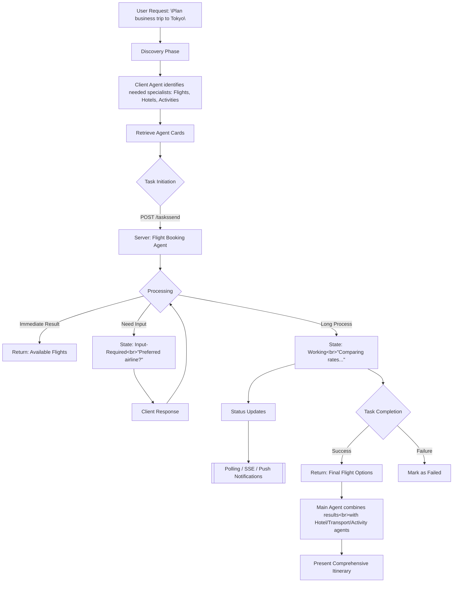

# mcp-server-demo

```mermaid
graph TD
  A["User Request: \"Plan business trip to Tokyo\""] --> B[Discovery Phase]
  B --> C[Client Agent identifies needed specialists: Flights, Hotels, Activities]
  C --> D[Retrieve Agent Cards]
  D --> E{Task Initiation}
  E --> |POST /taskssend| F[Server: Flight Booking Agent]
  F --> G{Processing}
  G -->|Immediate Result| H[Return: Available Flights]
  G -->|Need Input| I[State: Input-Required&lt;br&gt;&quot;Preferred airline?&quot;]
  G -->|Long Process| J[State: Working&lt;br&gt;&quot;Comparing rates...&quot;]
  I --> K[Client Response]
  K --> G
  J --> L[Status Updates]
  L --> M[[Polling / SSE / Push Notifications]]
  J --> N{Task Completion}
  N -->|Success| O[Return: Final Flight Options]
  N -->|Failure| P[Mark as Failed]
  O --> Q[Main Agent combines results&lt;br&gt;with Hotel/Transport/Activity agents]
  Q --> R[Present Comprehensive Itinerary]
```
